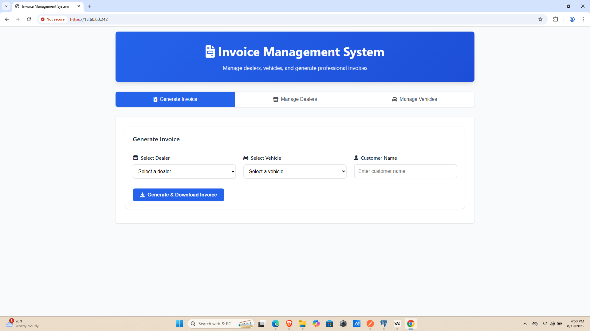

# 🚗 Vehicle Invoice Management System

A comprehensive Spring Boot application for managing vehicle sales with automated PDF invoice generation, featuring dealer management, vehicle inventory, and secure deployment on AWS EC2.

## 📋 Summary

This project is a complete vehicle sales management system that automates the invoice generation process. It provides RESTful APIs for managing dealers and vehicles, generates professional PDF invoices with QR codes, and is deployed on AWS EC2 with enterprise-grade security features including HTTPS, Nginx reverse proxy, and PostgreSQL database.

## 🛠️ Tech Stack


- **Backend**: Java 17, Spring Boot 3.2.5, Spring Data JPA
- **Database**: PostgreSQL (Production), H2 (Testing)
- **PDF Generation**: Apache PDFBox 2.0.29
- **QR Code**: ZXing (Google) 3.5.1
- **Security**: HTTPS/SSL, Nginx Reverse Proxy
- **Deployment**: AWS EC2 Ubuntu 24.04, Systemd Service
- **Build Tool**: Maven
- **Monitoring**: Spring Boot Actuator

## ✨ Features

### 🏢 Dealer Management
- Complete CRUD operations for dealer information
- Store dealer details: name, address, phone, email
- RESTful API endpoints with validation

### 🚙 Vehicle Inventory
- Comprehensive vehicle management system
- Track vehicle details: make, model, year, VIN, price
- Associate vehicles with dealers

### 📄 PDF Invoice Generation
- **Auto-fill PDF invoices** with dealer and vehicle details
- **Customer information** integration
- **Automatic tax calculation** (10% tax rate)
- **Unique invoice numbers** with timestamps
- **QR code generation** containing transaction IDs
- **Professional PDF layout** with company branding

### 🔒 Security & Deployment
- **HTTPS/SSL encryption** with self-signed certificates
- **Nginx reverse proxy** with security headers
- **Systemd service** for auto-restart functionality
- **PostgreSQL database** with proper user management
- **Environment-based configuration** for different environments

## 🌐 Live Deployment

**🔗 Application URL**: `https://13.60.60.242`

The application is successfully deployed on AWS EC2 with:
- ✅ HTTPS enabled with SSL certificates
- ✅ Nginx reverse proxy configuration
- ✅ PostgreSQL database setup
- ✅ Systemd service for automatic restarts
- ✅ Firewall configuration (ports 22, 80, 443)

## 📡 API Endpoints

### 🏢 Dealer Management
| Method | Endpoint | Description | Request Body |
|--------|----------|-------------|--------------|
| `GET` | `/api/dealers` | Get all dealers | - |
| `POST` | `/api/dealers` | Create new dealer | `{"name", "address", "phone", "email"}` |
| `GET` | `/api/dealers/{id}` | Get dealer by ID | - |
| `PUT` | `/api/dealers/{id}` | Update dealer | `{"name", "address", "phone", "email"}` |
| `DELETE` | `/api/dealers/{id}` | Delete dealer | - |

### 🚙 Vehicle Management
| Method | Endpoint | Description | Request Body |
|--------|----------|-------------|--------------|
| `GET` | `/api/vehicles` | Get all vehicles | - |
| `POST` | `/api/vehicles` | Create new vehicle | `{"make", "model", "year", "vin", "price", "dealerId"}` |
| `GET` | `/api/vehicles/{id}` | Get vehicle by ID | - |
| `PUT` | `/api/vehicles/{id}` | Update vehicle | `{"make", "model", "year", "vin", "price", "dealerId"}` |
| `DELETE` | `/api/vehicles/{id}` | Delete vehicle | - |

### 📄 Invoice Generation
| Method | Endpoint | Description | Request Body |
|--------|----------|-------------|--------------|
| `POST` | `/api/invoices` | Generate PDF invoice | `{"dealerId", "vehicleId", "customerName"}` |
| `GET` | `/api/invoices/generate` | Generate PDF (GET) | `?dealerId=1&vehicleId=1&customerName=John` |

### 🔍 Health & Monitoring
| Method | Endpoint | Description |
|--------|----------|-------------|
| `GET` | `/actuator/health` | Application health status |
| `GET` | `/actuator/metrics` | Application metrics |
| `GET` | `/actuator/info` | Application information |

## 📝 API Request/Response Examples

### Create Dealer
```bash
POST https://13.60.60.242/api/dealers
Content-Type: application/json

{
  "name": "Premium Auto Sales",
  "address": "123 Main Street, City, State 12345",
  "phone": "+1-555-0123",
  "email": "contact@premiumauto.com"
}
```

### Create Vehicle
```bash
POST https://13.60.60.242/api/vehicles
Content-Type: application/json

{
  "make": "Toyota",
  "model": "Camry",
  "year": 2023,
  "vin": "1HGBH41JXMN109186",
  "price": 25000.00,
  "dealerId": 1
}
```

### Generate Invoice
```bash
POST https://13.60.60.242/api/invoices
Content-Type: application/json

{
  "dealerId": 1,
  "vehicleId": 1,
  "customerName": "John Smith"
}
```

**Response**: Downloads PDF file with filename: `invoice_1_1_20250819_163000.pdf`

## 📸 Application Screenshots

### 1. Main Dashboard

*Main application interface showing the vehicle invoice management system with professional UI design*

### 2. Responsive UI - Adding Details

*Responsive form interface for adding dealer and vehicle information with real-time validation*

### 3. Invoice Download Success

*Success message displayed after successful PDF invoice generation and download*

### 4. PDF Invoice View

*Generated PDF invoice showing professional layout with dealer details, vehicle information, pricing, and QR code*

## 📄 Sample Invoice Output

The generated PDF invoice includes:

- **Header**: "VEHICLE SALES INVOICE" with professional styling
- **Invoice Details**: Unique invoice number, timestamp, transaction ID
- **Dealer Information**: Complete dealer contact details
- **Customer Information**: Customer name and details
- **Vehicle Information**: Make, model, year, VIN
- **Pricing Breakdown**: 
  - Base Price: $25,000.00
  - Tax (10%): $2,500.00
  - **Total Amount: $27,500.00**
- **QR Code**: Contains transaction ID for verification
- **Footer**: Professional closing message

## 📦 Dependencies

```xml
<!-- Core Spring Boot -->
<dependency>
    <groupId>org.springframework.boot</groupId>
    <artifactId>spring-boot-starter-web</artifactId>
</dependency>
<dependency>
    <groupId>org.springframework.boot</groupId>
    <artifactId>spring-boot-starter-data-jpa</artifactId>
</dependency>
<dependency>
    <groupId>org.springframework.boot</groupId>
    <artifactId>spring-boot-starter-validation</artifactId>
</dependency>
<dependency>
    <groupId>org.springframework.boot</groupId>
    <artifactId>spring-boot-starter-actuator</artifactId>
</dependency>

<!-- Database -->
<dependency>
    <groupId>org.postgresql</groupId>
    <artifactId>postgresql</artifactId>
</dependency>

<!-- PDF Generation -->
<dependency>
    <groupId>org.apache.pdfbox</groupId>
    <artifactId>pdfbox</artifactId>
    <version>2.0.29</version>
</dependency>

<!-- QR Code Generation -->
<dependency>
    <groupId>com.google.zxing</groupId>
    <artifactId>core</artifactId>
    <version>3.5.1</version>
</dependency>
<dependency>
    <groupId>com.google.zxing</groupId>
    <artifactId>javase</artifactId>
    <version>3.5.1</version>
</dependency>
```

## 🚀 Setup and Run

### Local Development

1. **Clone the repository**
```bash
git clone <repository-url>
cd invoice-app-fixed
```

2. **Configure Database**
```properties
# application.properties
spring.datasource.url=jdbc:postgresql://localhost:5432/invoice_app
spring.datasource.username=postgres
spring.datasource.password=your_password
```

3. **Build and Run**
```bash
mvn clean package
mvn spring-boot:run
```

4. **Access Application**
- Local URL: `http://localhost:8090`
- API Base: `http://localhost:8090/api`

### Production Deployment (AWS EC2)

1. **Build Application**
```bash
mvn clean package
```

2. **Deploy to EC2**
```bash
# Upload JAR file
scp -i myawskey.pem target/invoice-app-0.0.1-SNAPSHOT.jar ubuntu@13.60.60.242:~/

# Upload deployment scripts
scp -i myawskey.pem -r deployment/ ubuntu@13.60.60.242:~/

# SSH and run deployment
ssh -i myawskey.pem ubuntu@13.60.60.242
chmod +x deployment/complete-deployment.sh
sudo ./deployment/complete-deployment.sh
```

3. **Verify Deployment**
```bash
sudo systemctl status invoice-app
curl -k https://13.60.60.242/actuator/health
```

## 📁 Project Structure

```
invoice-app/
├── src/
│   ├── main/
│   │   ├── java/com/example/invoice/
│   │   │   ├── controller/
│   │   │   │   ├── DealerController.java
│   │   │   │   ├── VehicleController.java
│   │   │   │   └── InvoiceController.java
│   │   │   ├── entity/
│   │   │   │   ├── Dealer.java
│   │   │   │   └── Vehicle.java
│   │   │   ├── repository/
│   │   │   │   ├── DealerRepository.java
│   │   │   │   └── VehicleRepository.java
│   │   │   ├── service/
│   │   │   │   └── InvoiceService.java
│   │   │   ├── dto/
│   │   │   │   └── InvoiceRequest.java
│   │   │   └── InvoiceApplication.java
│   │   └── resources/
│   │       ├── application.properties
│   │       ├── application-prod.properties
│   │       └── static/
├── deployment/
│   ├── complete-deployment.sh
│   ├── database-setup.sql
│   ├── invoice-app.service
│   ├── nginx-config
│   └── ssl-setup.sh
├── pom.xml
└── README.md
```

## 🗄️ Database Schema

### Dealers Table
```sql
CREATE TABLE dealers (
    id BIGSERIAL PRIMARY KEY,
    name VARCHAR(255) NOT NULL,
    address TEXT,
    phone VARCHAR(20),
    email VARCHAR(255)
);
```

### Vehicles Table
```sql
CREATE TABLE vehicles (
    id BIGSERIAL PRIMARY KEY,
    make VARCHAR(100) NOT NULL,
    model VARCHAR(100) NOT NULL,
    year INTEGER NOT NULL,
    vin VARCHAR(17) UNIQUE NOT NULL,
    price DECIMAL(10,2) NOT NULL,
    dealer_id BIGINT REFERENCES dealers(id)
);
```

## 🔧 Configuration

### Environment Variables
```bash
# Database Configuration
SPRING_DATASOURCE_URL=jdbc:postgresql://localhost:5432/invoice_app_prod
SPRING_DATASOURCE_USERNAME=invoice_user
SPRING_DATASOURCE_PASSWORD=InvoiceApp2025!

# Application Configuration
SPRING_PROFILES_ACTIVE=prod
SERVER_PORT=8080
```

### Production Profile (`application-prod.properties`)
```properties
# Server Configuration
server.port=8080

# Database Configuration
spring.datasource.url=jdbc:postgresql://localhost:5432/invoice_app_prod
spring.datasource.username=invoice_user
spring.datasource.password=${DB_PASSWORD}

# JPA Configuration
spring.jpa.hibernate.ddl-auto=update
spring.jpa.show-sql=false

# Security Configuration
server.servlet.session.cookie.secure=true
server.servlet.session.cookie.http-only=true
```

## 🛡️ Security Features

- **HTTPS/SSL Encryption**: All traffic encrypted with SSL certificates
- **Nginx Security Headers**: HSTS, X-Frame-Options, X-Content-Type-Options
- **Database Security**: Dedicated database user with limited privileges
- **Systemd Security**: NoNewPrivileges, PrivateTmp, ProtectSystem
- **Firewall Configuration**: Only necessary ports (22, 80, 443) open
- **Input Validation**: Jakarta Bean Validation on all API endpoints

## 📊 Monitoring & Health Checks

- **Health Endpoint**: `/actuator/health` - Application health status
- **Metrics Endpoint**: `/actuator/metrics` - Application performance metrics
- **Systemd Monitoring**: Automatic service restart on failure
- **Log Management**: Centralized logging via systemd journal

## 🚀 Performance Features

- **Connection Pooling**: HikariCP for database connections
- **JPA Optimization**: Hibernate with PostgreSQL dialect
- **Nginx Caching**: Static content caching and gzip compression
- **PDF Generation**: Efficient in-memory PDF creation
- **QR Code Optimization**: Cached QR code generation

## 🧪 Testing

### Manual API Testing
```bash
# Test Health Endpoint
curl -k https://13.60.60.242/actuator/health

# Test Dealer Creation
curl -X POST https://13.60.60.242/api/dealers \
  -H "Content-Type: application/json" \
  -d '{"name":"Test Dealer","address":"123 Test St","phone":"555-0123","email":"test@dealer.com"}'

# Test Invoice Generation
curl -X GET "https://13.60.60.242/api/invoices/generate?dealerId=1&vehicleId=1&customerName=John%20Doe" \
  --output sample-invoice.pdf
```

## 📞 Contact Information

**Developer**: Aman Tiwari

- 📧 **Email**: [attiwari261@gmail.com](mailto:attiwari261@gmail.com)
- 📱 **Phone**: +91 7987842951
- 💼 **LinkedIn**: [amantiwarie](https://linkedin.com/in/amantiwarie)
- 🌐 **GitHub**: [amantiwarie](https://github.com/amantiwarie)

## 📄 License

This project is developed as part of a technical assessment for Dealers Auto Center.

---

## 🎯 Task Completion Status

✅ **Task 1**: Frontend Development - Complete  
✅ **Task 2**: Backend API Development - Complete  
✅ **Task 3**: PDF Auto-Fill Invoice Generation - Complete  
✅ **Task 4**: Server Deployment & Security - Complete  

**Deployment URL**: https://13.60.60.242

---

*This project demonstrates full-stack development capabilities, including modern web technologies, secure deployment practices, and enterprise-grade application architecture.*
